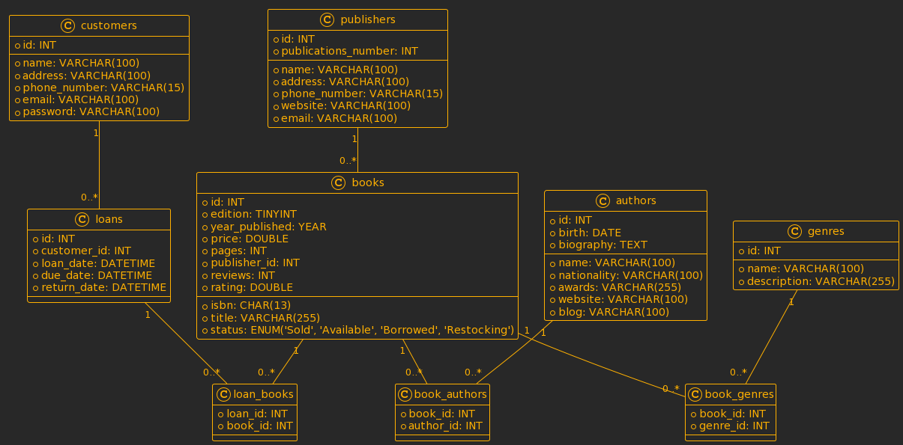

# MySQL Project Documentation

## Generic Info

This repository contains a collection of MySQL database-related artifacts, including SQL scripts, Python code for CRUD operations, procedural code, and documentation.

## Project Structure

### pa1:

- **create_tables.sql**: SQL script for creating all the necessary database tables.
  
- **dummy_data.sql**: SQL script for inserting dummy data into the tables.
- **image.png**: PlanUML class diagram representing the database schema.
- **schema.sql**: SQL script containing a set of different queries for data manipulation.

### pa2:

- **indexes.sql**: SQL script for dropping and creating indexes on specific columns in the tables.

### pa3:

- **subqueries.sql**: SQL script containing CRUD queries with correlational and non-correlational subqueries.
- **crud_application.py**: Python script for performing CRUD operations on the database.
- **showcase-1.png**: Screenshot showcasing the functionality of the Python code.
- **showcase-2.png**: Another screenshot showcasing the functionality of the Python code.

### pa4:

- **procedures.sql**: SQL script containing stored procedures for various database operations, including transaction handling.
- **executions.sql**: SQL script for executing the stored procedures.

### pa5:

- **views.sql**: SQL script for creating views to retrieve specific data from the tables.
- **[bonus.md](http://bonus.md/)**: Documentation providing guidelines for contributing to the MySQL Project Libraries repository.

## How to Deploy the Project

1. Create a MySQL database instance.
2. Clone the repository to your local machine:
    
    ```bash
    git clone https://github.com/your-username/MySQL_project_libraries.git
    ```
    
3. Navigate to the project directory:
    
    ```bash
    cd MySQL_project_libraries
    ```
    
4. Run the SQL scripts in the respective **`pa1`**, **`pa2`**, **`pa3`**, **`pa4`**, and **`pa5`** directories to set up the database schema, indexes, procedures, views, and other artifacts.
5. Execute the Python CRUD application script **`crud_application.py`** in **`pa3`** directory to interact with the database.

## **Bonus Task**

The **`bonus.md`** file provides documentation on how to contribute to the MySQL Project Libraries repository. Follow the instructions outlined in the document to contribute to the project.

## **About the Author**

This project was developed by [Levko Beniakh](https://www.linkedin.com/in/levko-beniakh-91a2422b4/), a passionate software developer interested in database management and application development.

For any inquiries or assistance, feel free to contact the author at [lbeniakh@kse.org.ua](mailto:lbeniakh@kse.org.ua)